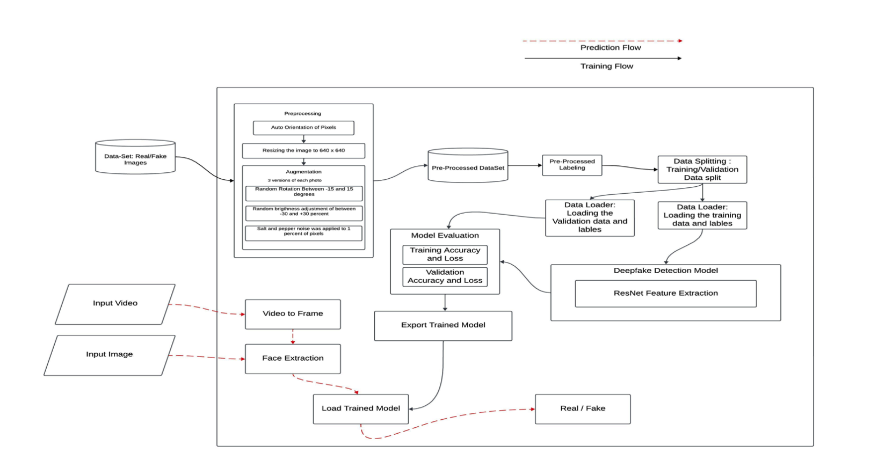
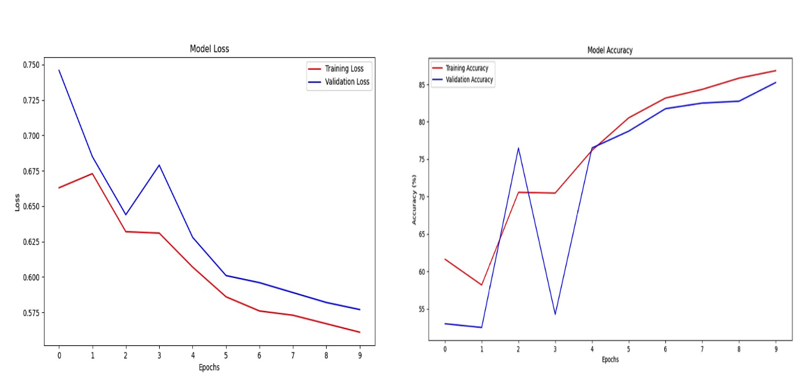

# Deepfake Detection Using ResNet

## Overview
This project focuses on developing a streamlined, efficient, and high-performing machine learning model to detect and classify deepfake videos and images. Leveraging the ResNet architecture with pre-trained ImageNet weights, the model achieves competitive accuracy while requiring fewer computational resources and training data. This innovative approach addresses the growing challenge of detecting manipulated visual content in an era of increasing digital misinformation.

---

## Features
- **ResNet-based Architecture**: Utilizes ResNet's proven reliability for deep learning tasks to classify media as "Real" or "Fake."
- **Efficient Training**: Achieves 81% accuracy on test data with a small training dataset (4,200 images) and just 10 training epochs.
- **Preprocessing and Augmentation**:
  - Image resizing and orientation adjustments for standardization.
  - Augmentations like random rotation, brightness adjustments, and noise addition for robustness.
- **Dual Media Support**: Provides tailored programs for image and video deepfake detection.
  - Images are classified directly.
  - Videos are split into frames for per-frame analysis, aggregated into a final classification.
- **Optimized Resource Usage**: Maintains high detection accuracy without relying on extensive datasets or computational power.

---

## System Architecture

  

---

## Methodology
1. **Preprocessing**: Images undergo resizing, noise addition, and augmentation to enhance diversity and robustness.
2. **Labeling**: Data is categorized into folders representing real and fake media.
3. **Data Splitting**: Data is divided into training, testing, and validation sets for effective evaluation.
4. **Model Training**: ResNet, with pre-trained ImageNet weights, is fine-tuned for deepfake detection.
5. **Evaluation**: Model performance is assessed after each epoch using metrics such as loss and accuracy.
6. **Export and Prediction**:
   - The best model is selected based on validation performance.
   - Separate programs are implemented for image and video classification.

---
## Training Progress

| **Epoch** | **Training Accuracy** | **Training Loss** | **Validation Accuracy** | **Validation Loss** |
|-----------|------------------------|--------------------|--------------------------|----------------------|
| 1         | 61.63%                | 0.663              | 53.00%                  | 0.746                |
| 2         | 58.18%                | 0.673              | 52.50%                  | 0.685                |
| 3         | 70.57%                | 0.632              | 76.50%                  | 0.644                |
| 4         | 70.47%                | 0.631              | 54.25%                  | 0.679                |
| 5         | 76.18%                | 0.607              | 76.50%                  | 0.628                |
| 6         | 80.53%                | 0.586              | 78.75%                  | 0.601                |
| 7         | 83.17%                | 0.576              | 81.75%                  | 0.596                |
| 8         | 84.33%                | 0.573              | 82.50%                  | 0.589                |
| 9         | 85.83%                | 0.567              | 82.75%                  | 0.582                |
| 10        | 85.83%                | 0.567              | 82.75%                  | 0.582                |

---

## Loss And Accuracy Graphs

  

## Results
- Achieved ~83% accuracy on a test dataset of 10,000 images, trained on a smaller dataset compared to existing models.
- Outperformed resource-intensive models in terms of computational efficiency while maintaining competitive accuracy.

---

## Limitations and Future Scope
- **Preprocessing Overhead**: Dataset preprocessing increases training time.
- **Future Enhancements**:
  - Experimenting with hybrid architectures (e.g., ResNet + LSTM).
  - Expanding dataset size for improved generalization.
  - Reducing training time through optimized preprocessing techniques.

---

## Conclusion
This project demonstrates a resource-efficient approach to deepfake detection, emphasizing precision and scalability. By leveraging the ResNet architecture, the model effectively tackles the challenges posed by deepfakes, ensuring digital content integrity in an era of synthetic media proliferation.

---

### References
- [Deepfake Detection Survey](https://medium.com/@werdeepfakers/faceforensics-survey-of-multi-modal-techniques-7b637fc161d0)
- [FaceForensics++ Paper](https://ceur-ws.org/Vol-3058/Paper-034.pdf)
- [Advances in Deepfake Detection](https://medium.com/@byanalytixlabs/detecting-deepfakes-exploring-advances-in-deep-learning-based-media-authentication-5871b1226cea)
